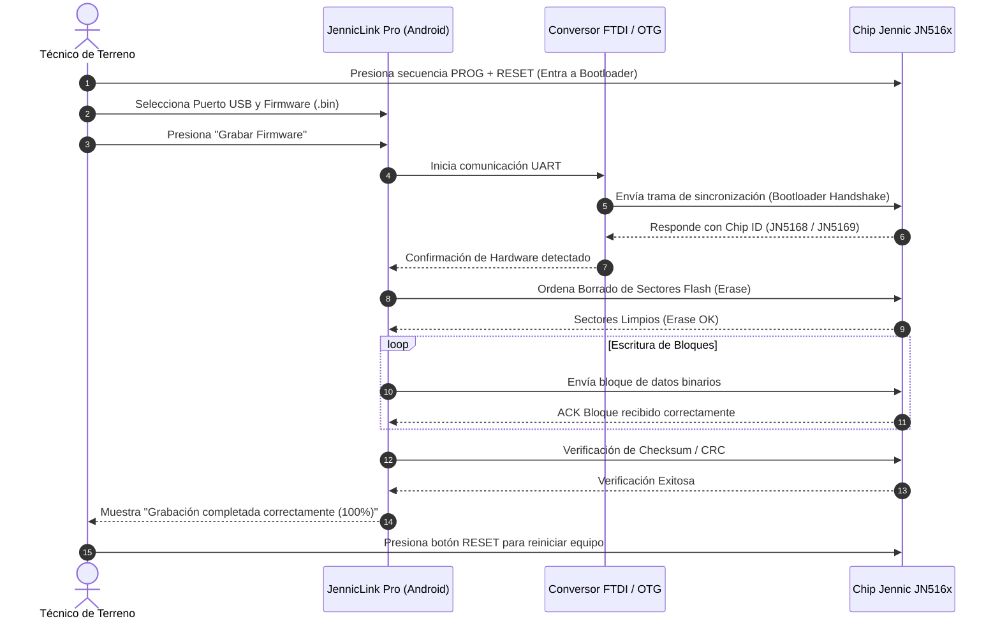

# Guía Paso a Paso Ultra Detallada: Grabación e Instalación de Firmware en Nodos Jennic JN516x

Esta guía técnica explica minuciosamente el procedimiento para realizar la grabación (flasheo) de firmware en microcontroladores **NXP Jennic JN5168 y JN5169** utilizando la aplicación móvil **JennicLink Pro** en teléfonos Android a través de conexión USB OTG.

---

## Índice de Contenidos
1. [Requisitos de Hardware y Conectividad](#1-requisitos-de-hardware-y-conectividad)
2. [Obtención y Sincronización del Archivo de Firmware (.bin) - Detallado](#2-obtención-y-sincronización-del-archivo-de-firmware-bin---detallado)
3. [Secuencia de Entrada en Modo Programación (Bootloader)](#3-secuencia-de-entrada-en-modo-programación-bootloader)
4. [Procedimiento de Grabación Paso a Paso en JennicLink Pro](#4-procedimiento-de-grabación-paso-a-paso-en-jenniclink-pro)
5. [Proceso Interno de Grabación del Bootloader](#5-proceso-interno-de-grabación-del-bootloader)
6. [Puesta en Marcha y Verificación Post-Flasheo](#6-puesta-en-marcha-y-verificación-post-flasheo)
7. [Guía de Solución de Problemas (Troubleshooting)](#7-guía-de-solución-de-problemas-troubleshooting)

---

## 1. Requisitos de Hardware y Conectividad

Para realizar la grabación en terreno o taller se requieren los siguientes elementos:

### A. Dispositivo Móvil
*   Smartphone o Tablet Android con sistema operativo **Android 7.0 o superior**.
*   Soporte para función **USB Host / OTG (On-The-Go)** activo en la configuración del teléfono.

### B. Cableado y Adaptadores
*   **Adaptador USB OTG**: Transforma el puerto de carga del teléfono (USB Type-C o Micro-USB) en un puerto USB-A Hembra estándar.
*   **Módulo Conversor USB a Serial TTL (3.3V)**:
    *   *Chips compatibles*: FTDI (FT232RL), Silicon Labs (CP2102/CP2104), WCH (CH340G/CH341), Prolific (PL2303).
    *   *Nivel Lógico*: **MANDATORIO 3.3V**. *(No conectar convertidores RS232 estándar de 12V ni señales TTL de 5V directas para no dañar el chip Jennic)*.

### C. Mapeo de Pines (Pinout)
Al conectar el conversor USB-Serial a la placa o nodo Jennic, la asignación de pines debe ser:

| Pin Conversor USB-Serial | Pin Placa Jennic | Descripción de la Señal |
| :--- | :--- | :--- |
| **TXD** (Transmit) | **RXD** (Receive / SPIMISO / IO0) | Transmisión de datos desde el celular hacia el Jennic |
| **RXD** (Receive) | **TXD** (Transmit / SPIMOSI / IO1) | Recepción de respuestas desde el Jennic hacia el celular |
| **GND** (Ground) | **GND** (Tierra común) | Referencia de voltaje común (MANDATORIO) |
| **VCC (3.3V)** | **3.3V / VCC** | Alimentación de la placa (solo si no posee fuente externa) |

---

## 2. Obtención y Sincronización del Archivo de Firmware (.bin) - Detallado

Para cargar el programa en el microcontrolador Jennic, necesitas el archivo binario compilado (extensión `.bin`). Para transferir este archivo desde una computadora con Linux/Ubuntu al celular mediante Wi-Fi, existen 3 métodos detallados:

---

### MÉTODOS A: Sincronización Directa por SSH/SFTP (Recomendado sin programas extra)

Este método permite que el celular se conecte de forma remota y segura a la laptop de Ubuntu, navegue por sus carpetas y descargue los archivos `.bin` directamente a la app.

#### PASO A.1: Preparación Única en la PC con Ubuntu (Servidor SSH)
En la computadora donde están guardados los archivos `.bin`, debes preparar el sistema por única vez ejecutando los siguientes comandos en la terminal (`Ctrl + Alt + T`):

1. **Instalar el servidor OpenSSH**:
   Por defecto, Ubuntu Desktop no acepta conexiones externas. Instálalo con:
   ```bash
   sudo apt update && sudo apt install -y openssh-server
   ```
   *(Escribe tu contraseña de Ubuntu cuando te la pida).*

2. **Verificar que el servicio SSH esté activo**:
   Confirma que el servicio se esté ejecutando en segundo plano con:
   ```bash
   sudo systemctl status ssh
   ```
   *(Debe aparecer en color verde el mensaje `active (running)`).* Si no está activo, inícialo con:
   ```bash
   sudo systemctl enable --now ssh
   ```

3. **Abrir el Puerto 22 en el Firewall de Ubuntu (`ufw`)**:
   SSH utiliza el **Puerto 22** de forma predeterminada. Si la laptop tiene el firewall encendido, debes abrir el paso ejecutando:
   ```bash
   sudo ufw allow 22/tcp
   ```
   *(Esto garantiza que la PC acepte la conexión proveniente del celular en la red Wi-Fi).*

4. **Habilitar la autenticación por Contraseña (Si aplica)**:
   Si la computadora pertenece a una red corporativa con políticas estrictas, verifica que permita inicio de sesión con contraseña:
   * Abre el archivo de configuración:
     ```bash
     sudo nano /etc/ssh/sshd_config
     ```
   * Asegúrate de que la línea `PasswordAuthentication` diga `yes` (y que no tenga un `#` al inicio).
   * Guarda los cambios con `Ctrl + O` -> `Enter` y sal con `Ctrl + X`.
   * Reinicia el servicio: `sudo systemctl restart ssh`.

5. **Identificar la Dirección IP de Wi-Fi de la PC**:
   En la terminal de la computadora ejecuta:
   ```bash
   hostname -I
   ```
   * Te saldrán una o varias direcciones IP. **Elige la IP que pertenezca a la red Wi-Fi local** (por lo general empieza por `192.168.1.xxx` o `172.20.10.xxx`).
   * *Nota importante*: Ignora direcciones IP que empiecen por `10.9.x.x` (corresponden a interfaces de VPN que no son accesibles desde el celular).

---

#### PASO A.2: Configuración y Descarga en la App del Celular

1. Conecta tu celular al **mismo Wi-Fi** que la laptop Ubuntu.
2. Abre la aplicación **JennicLink Pro** en tu teléfono y ve a la pestaña **Grabador (Flasher)**.
3. En la tarjeta superior **"Sincronización de PC (Wi-Fi)"**, completa los campos:
   * **IP de tu PC**: Escribe la IP obtenida en la PC (ejemplo: `192.168.1.40`).
   * **Usuario SSH**: Ingresa el nombre de usuario de Ubuntu (ejemplo: `innovex`).
   * **Contraseña**: Escribe la contraseña con la que inicias sesión en la laptop.
   * **Ruta en PC**:
     * Para buscar en tus documentos y descargas: escribe `/home/tu_usuario` (ej: `/home/innovex`).
     * Para buscar en absolutamente **todo el disco duro**: escribe `/`.
4. Presiona el botón **"Sinc"**:
   * El celular se conectará de forma segura a la laptop por el puerto 22.
   * La app realizará una búsqueda recursiva por las subcarpetas encontrando todos los archivos con extensión `.bin`.
5. En la lista desplegable de resultados en el celular, presiona el botón **"Bajar"** al lado del archivo `.bin` deseado.
   * El archivo se descargará a la memoria interna de la aplicación y quedará guardado para siempre, permitiéndote flashear en terreno **incluso sin internet ni Wi-Fi**.

---

### MÉTODO B: Sincronización mediante Servidor Autónomo (`simple_server.py`)

Si estás en la computadora de un cliente o compañero donde **no se puede instalar el servicio de SSH**, puedes usar el script portátil en Python:

1. En la computadora, descarga o copia el archivo `simple_server.py`.
2. Coloca los archivos de firmware `.bin` en la carpeta **Descargas** de la PC.
3. Abre la terminal en esa carpeta y ejecuta:
   ```bash
   python3 simple_server.py
   ```
   *(El script abrirá un servidor liviano en el **Puerto 5000**).*
4. En el celular, desmarca la opción de SSH si estuviera activa, ingresa la IP de esa PC y presiona **"Sinc"**.

---

### MÉTODO C: Transferencia Manual Directa al Celular

Si recibiste el archivo `.bin` a través de WhatsApp, Telegram, correo electrónico o mediante un pendrive USB:

1. Descarga o copia el archivo en la memoria interna del teléfono (por ejemplo, en la carpeta `Descargas` / `Downloads`).
2. Al estar en el celular, la aplicación **JennicLink Pro** detectará automáticamente el archivo `.bin` en la lista desplegable de firmwares locales sin requerir sincronización Wi-Fi.

---

## 3. Secuencia de Entrada en Modo Programación (Bootloader)

Para que la memoria Flash del microcontrolador Jennic acepte ser reescrita, **el chip no debe estar ejecutando el programa principal**. Debe iniciarse en modo **Bootloader de Fábrica**.

### Procedimiento Manual de Botones (PROG + RESET):
1. Ubica los dos botones de control en la placa Jennic:
   * Botón de Estado / Programación: Marcado como **`PROG`** (conectado al pin `IO0 / SPIMISO`).
   * Botón de Reinicio: Marcado como **`RESET`** (conectado al pin `RSTN`).
2. **Paso 1**: Mantén presionado sin soltar el botón **`PROG`**.
3. **Paso 2**: Sin soltar `PROG`, presiona una sola vez el botón **`RESET`** (durante 1 segundo) y suéltalo.
4. **Paso 3**: Espera 1 segundo y finalmente suelta el botón **`PROG`**.

> **Nota de Verificación**: Cuando el chip está en modo Bootloader, los LEDs de transmisión dejan de parpadear y la consola serial no emitirá mensajes periódicos. El microcontrolador queda a la espera de la firma de sincronización por el puerto RXD.

---

## 4. Procedimiento de Grabación Paso a Paso en JennicLink Pro

Una vez que el nodo está en modo Bootloader y el cable OTG está conectado:



### Pasos detallados en la Pantalla del Celular:

1. **Seleccionar el Puerto USB OTG**:
   * Abre la pestaña **Grabador (Flasher)**.
   * En el cuadro *"Configuración de Grabación"*, presiona el botón **Refrescar (🔄)**.
   * Selecciona el puerto detectado (ejemplo: `FT232R USB UART` o `CP2102 USB to UART Bridge`).

2. **Seleccionar el archivo de Firmware**:
   * Despliega la lista *"Firmware local (.bin)"*.
   * Toca el firmware que deseas flashear.

3. **Selección de Velocidad (Baudrate)**:
   * **Opción Estándar (Sin marcar)**: Transmite a **115200 baudios**. Es la opción recomendada por rapidez (tarda aprox. 15 a 20 segundos).
   * **Casilla "Baudrate lento (38400 baudios)" (Marcada)**: Reduce la velocidad de comunicación a **38400 baudios**. Usar únicamente si la tarjeta se encuentra en un gabinete con mucha interferencia, si los cables son muy largos o si el proceso falla en 115200.

4. **Iniciar la Grabación**:
   * Revisa que el nodo esté en modo Bootloader.
   * Toca el botón destacado **"Grabar Firmware"**.

---

## 5. Proceso Interno de Grabación del Bootloader

Al presionar el botón, la aplicación ejecuta de forma automatizada el protocolo oficial de NXP Jennic en la caja de registros (*Salida de Consola*):

1. **`Conectando al puerto USB...`**: Abre el canal serial Android USB Host a través de la librería `usb-serial-for-android`.
2. **`Enviando secuencia de sincronización...`**: Envía ráfagas de caracteres de prueba para ajustar el reloj interno del chip.
3. **`Chip detectado: JN5168 / JN5169 (Flash ID: 0x...)`**: La app lee el registro interno de fabricación del microcontrolador y valida que el `.bin` sea compatible.
4. **`Borrando memoria Flash...`**: Envía el comando de limpiado de memoria para eliminar la versión previa de firmware.
5. **`Escribiendo firmware... [X%]`**: Envía los bloques de 128 bytes progresivamente actualizando la barra de estado.
6. **`Verificando integridad (Checksum)...`**: Compara la suma de verificación enviada vs la almacenada en la RAM del chip.
7. **`¡Grabación completada con éxito!`**: Cierra de forma segura el canal de grabación y libera el puerto USB.

---

## 6. Puesta en Marcha y Verificación Post-Flasheo

Una vez que la aplicación indica que el proceso ha finalizado al 100%:

1. **Reiniciar el Nodo**:
   * El chip sigue en modo programador. **Debes presionar una vez el botón `RESET`** de la tarjeta para que el nuevo firmware empiece a ejecutarse.
2. **Monitorear el Arranque**:
   * Cambia a la pestaña **Consola Serial (115.2k)** en la aplicación.
   * Toca **"Conectar Puerto"**.
   * Deberás ver los mensajes de inicialización del equipo en pantalla (por ejemplo: las lecturas del chip, versión de software recién instalada y transmisión hacia la antena).

---

## 7. Guía de Solución de Problemas (Troubleshooting)

### A. Error: "No se detectaron puertos USB"
* **Causa**: El adaptador OTG no está bien insertado, o el teléfono no reconoce el convertidor.
* **Solución**:
  1. Desconecta y vuelve a conectar el adaptador OTG.
  2. Revisa si tu teléfono Android requiere activar explícitamente la opción *"Conexión OTG"* en el menú de `Ajustes -> Sistema` o `Ajustes -> Bluetooth y conexiones`.
  3. Asegúrate de otorgar el permiso desplegable *"Permitir a JennicLink Pro acceder al dispositivo USB"* en el cuadro de diálogo de Android.

### B. Error: "Fallo de sincronización con el Bootloader" / "Timeout de conexión"
* **Causa**: El microcontrolador Jennic está corriendo el programa antiguo y no entró en modo Bootloader.
* **Solución**:
  1. Repite la secuencia de botones: Mantén `PROG` -> Presiona y suelta `RESET` -> Suelta `PROG`.
  2. Verifica que las líneas **TXD** y **RXD** del conversor USB no estén invertidas (intenta cruzar TX con RX y RX con TX).
  3. Asegúrate de que el GND del conversor esté conectado firmemente al GND de la placa Jennic.

### C. Error: "Fallo de Checksum" o la grabación se interrumpe a mitad de camino
* **Causa**: Ruido electromagnético o caída de voltaje en la línea USB durante la programación.
* **Solución**:
  1. Marca la casilla **"Baudrate lento (38400 baudios)"** en la app para mayor tolerancia a fallos.
  2. Utiliza un cable OTG más corto o de mejor blindaje.
  3. Alimenta la tarjeta Jennic con una fuente externa de 3.3V/5V regulada si el puerto USB del celular no entrega suficiente corriente.
